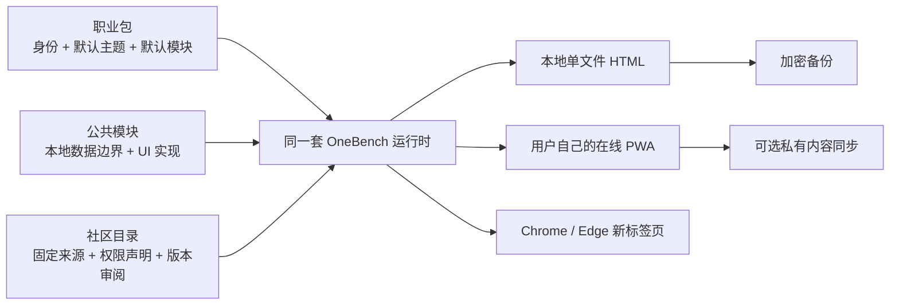

# 一句工作台 / OneBench

> 不会搭网站也没关系。说一句“我是谁、最想管什么”，就得到一份当天能开始使用的工作台。

OneBench 是开源、配置驱动、本地优先的个人工作台底座。它不是空白看板生成器：每个职业包都带自己的主题、首页结构、场景模块、真实示例内容和可操作状态。默认生成可双击打开的单文件 HTML 与桌面快捷方式；需要手机、多电脑和长期迭代时，再升级到用户自己的私有仓库与线上 PWA。

## 直接体验

[打开 OneBench Demo](https://diyiwuyan.github.io/onebench/)：打开就是一份真实可操作的“考研 180 天冲刺台”。可修改头像、称呼和工作台名称，切换 8 个职业包与对应主题，增减模块、勾任务、开番茄钟、写随手记、备份和恢复。它与下载到电脑的 HTML、手机 PWA、浏览器新标签页使用同一套工作台代码。

## 第一次使用：不需要懂技术

1. 打开 Demo，点“定制”填写称呼、选择头像和身份；职业包会自动换好主题与默认模块。
2. 点“下载本地版”，得到一个可放到桌面、双击打开的完整 HTML。
3. 需要手机时，让智能体升级为你自己账号下的在线 PWA，再添加到主屏幕。

详细说明见 [给第一次使用的人](docs/BEGINNER.md)。想交给智能体，直接复制 [一句发给智能体](docs/AGENT-STARTER.md)。

## 三种使用方式

| 方式 | 适合谁 | 用户得到什么 |
| --- | --- | --- |
| 默认本地版 | 只在一台电脑使用、不会技术的用户 | 独立 HTML 文件和桌面快捷方式；双击打开，内容留在本机。 |
| 私有同步版 | 需要手机或多台电脑的用户 | 自己账号下的线上 PWA 与私有数据仓库；选择后才同步日常内容。 |
| 浏览器新标签页 | 常在 Chrome／Edge 工作的用户 | 加载 `dist/extension` 后，每次打开新标签页就是工作台。 |

## 一键拥有，而不是只拿到一个临时链接

使用 `onebench-deploy` Skill 的智能体必须交付用户自己账号下的完整仓库、`workspace.json`、自动部署工作流和可打开的网址；不能只交一个临时平台链接或静态文件夹。以后只需说“帮我改成……”，智能体就在该仓库修改、测试并自动更新网页。完整规则见 [用户拥有权](docs/OWNERSHIP.md)。

每个用户仓库都能保留 OneBench 官方上游，公共模块和模板目录通过固定来源、版本与权限声明进行更新；目录不会在浏览器中静默执行第三方代码。见 [社区目录与贡献](docs/COMMUNITY.md)。

## 首期职业／学习包：选什么，会得到什么

| 你是谁 | 默认主题 | 默认帮你理顺什么 |
| --- | --- | --- |
| 大学生 | 校园晴空 | 课程、作业 DDL、考证、阅读与身心状态 |
| K12 教师 | 黑板鼠尾草 | 课表、备课、班级事项、教研沟通与复盘 |
| 考研 | 冲刺暖杏 | 倒计时、真题、错题、公告、专注与阶段目标 |
| 考公 | 上岸政务蓝 | 行测申论、刷题、公告报名、专注与复盘 |
| 内容创作者 | 创作珊瑚 | 灵感收件箱、创作流水线、发布日历与数据复盘 |
| 产品／运营 | 产品石墨 | 需求收件箱、项目节点、会议、决策与周报 |
| 自由职业者 | 独立橄榄 | 客户项目、收入回款、个人节奏与专注 |
| 团队负责人 | 管理雾紫 | 团队目标、会议、决策、项目与管理复盘 |

每个包都会先装入日历、待办、快速记录、习惯打卡、个人资料、主题、同步和设置；再加入与身份真正相关的内容。当前内置 32 个可组合模块、8 套职业主题。切换职业包时，主题、引导语、默认模块和示例内容一起切换；用户仍可单独换主题或从模块市场增减能力，不需要重新搭页面。

模块市场离线内置官方模块，并可联网读取 OneBench 公共目录。目录条目声明来源、固定版本、所需权限和模块组合；浏览器不会直接执行陌生远程代码。经过 PR 审阅的源码随 OneBench 版本进入用户自己的项目，个人配置和日常数据仍由用户掌握。

## 开源生态怎么组成



- 想贡献一个职业版本：提交模板包、主题、默认模块和桌面／手机截图。
- 想贡献一个模块：登记模块 ID、数据边界与 UI 实现，再进入公共目录。
- 想更新公共能力：联网刷新目录元数据，审阅固定版本源码，通过完整测试后再合并。
- 想保留自己的修改：用户仓库跟踪 OneBench 上游；升级时保留 `workspace.json` 与本地数据边界。

## 给智能体的一句话：只填两处

复制下面一段，把 `【身份】` 和 `【想管理的事】` 换掉即可。不会精确填写也没关系：写“学生”和“学习”可以生成；但写成“大学生，课程、作业和考证”会更贴合。

```text
请使用 OneBench 开源方案帮我搭建个人工作台：
https://github.com/diyiwuyan/onebench/tree/main/skills/onebench-deploy

我是【身份】，最想管理【想管理的事】。请先生成并验收一份完整可用的本地工作台；我还要在手机上使用，请再升级为我自己账号下的在线版。我不懂 GitHub、部署和模块，请由你处理。完成后只告诉我：电脑怎么打开、手机怎么添加到桌面、以后怎么修改这三件事。
```

可直接照抄的示例：`我是大学生，最想管理课程、作业和考证。` 或 `我是退休教师，最想把每天的待办和资料理清楚。`

## 当前已实现

- `workspace.json` v1 协议与模块注册表
- 8 个职业／学习场景包、8 套联动主题、32 个内置模块
- 本地保存的称呼、头像／照片、工作台名称与主题设置
- 真实可操作的职业工作台、单文件离线 HTML 与桌面快捷方式
- 同一套运行时输出 Demo、本地 HTML、在线 PWA 与浏览器新标签页
- 本地保存、AES-GCM 加密迁移包、日常数据的可选私有同步
- GitHub Contents API 拉取／推送配置（仅配置，不上传私密任务数据）
- 模板／模块贡献规范、公共目录快照与 JSON Schema
- 模块数据边界协议与可分发的 `onebench-deploy` 智能体 Skill

## 新标签页扩展

除了网页和手机桌面，OneBench 也可成为 Chrome／Edge 的浏览器新标签页。执行 `npm run build:extension`，再加载 `dist/extension` 即可。详细步骤见 [浏览器扩展](docs/BROWSER-EXTENSION.md)。

## 社区目录

- 目录协议：`packages/community-registry/registry.json`
- 校验目录：`npm run validate:registry`
- 从公共仓库刷新目录：`npm run update:registry`
- 贡献模板／模块：[社区目录与贡献](docs/COMMUNITY.md)

## 开发

```bash
npm install
npm run dev
```

## GitHub 同步

创建 Fine-grained personal access token，仅授予目标仓库的 **Contents: Read and write** 权限。Token 仅保存在当前浏览器的本地存储中；公共演示环境请不要填写真实 token。

## 后续

下一阶段可接入经过审阅的第三方连接器与正式 GitHub OAuth 应用。当前已具备用户仓库交付协议、公共目录校验、模板 PR 校验、冲突提示、加密备份与浏览器新标签页打包。
